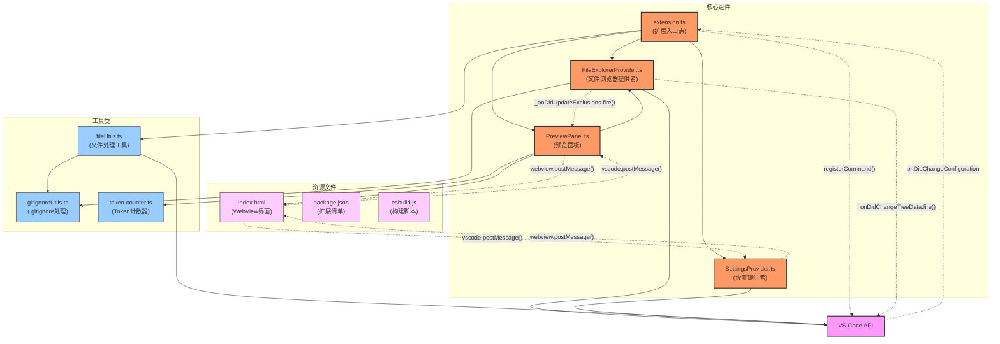
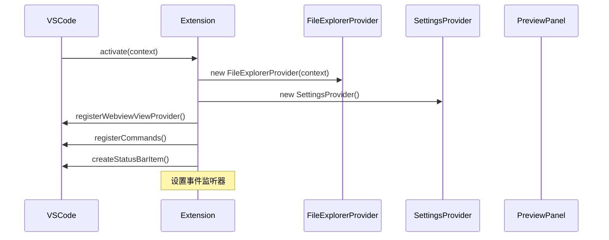
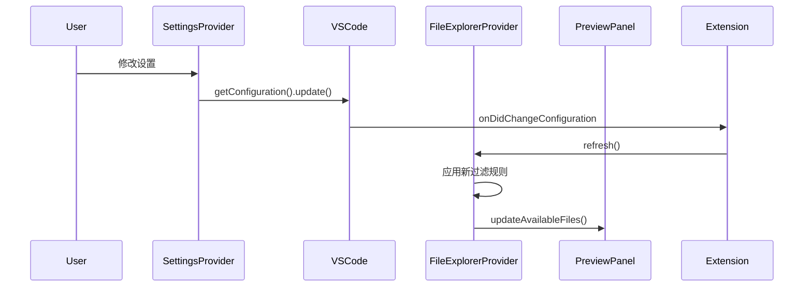
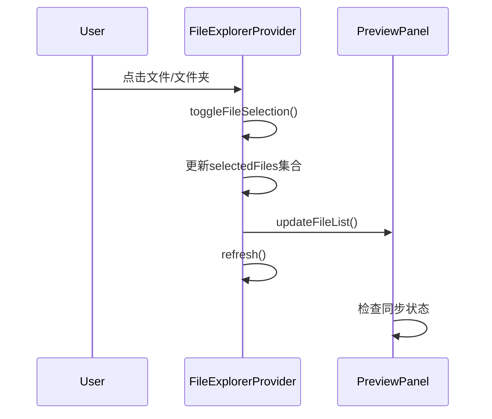
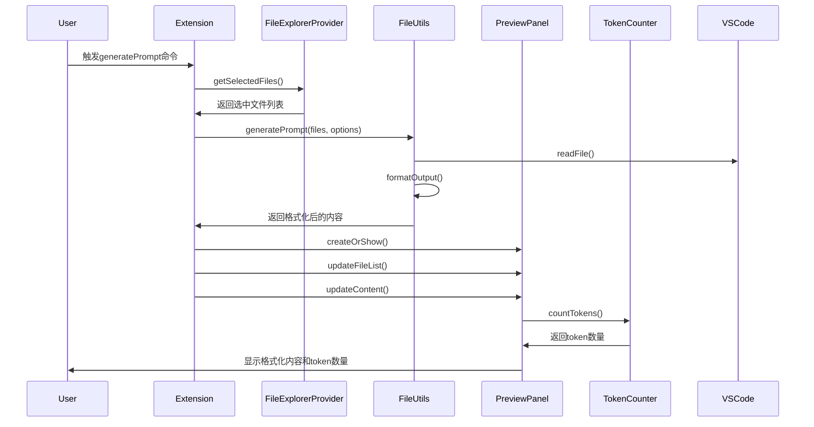
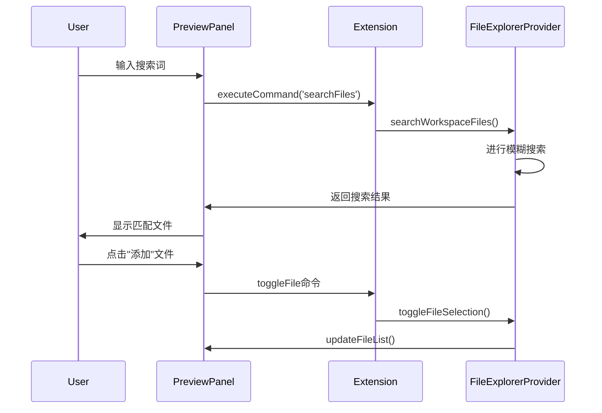

# Files to LLM Prompt - 架构分析

## 1. 概述

"Files to LLM Prompt" 是一个 VS Code 扩展，它允许用户选择工作区中的文件，将它们格式化为适合大型语言模型(LLM)的提示词格式。该扩展特别针对 Claude 的 XML 格式进行了优化，提供了交互式文件浏览、实时预览和格式化功能。

## 2. 核心组件

扩展由以下几个主要组件构成：

1. **Extension.ts** - 扩展入口点，负责组件初始化和协调
2. **FileExplorerProvider** - 文件浏览和选择管理
3. **SettingsProvider** - 用户配置管理
4. **PreviewPanel** - 提示词预览和格式化
5. **工具类**：
   - **fileUtils** - 文件处理和格式化函数
   - **gitignoreUtils** - .gitignore 规则处理
   - **token-counter** - Token 计数功能

## 3. 架构模式

该扩展采用了 VS Code 推荐的架构模式：

- **提供者模式（Provider Pattern）**：通过 FileExplorerProvider 和 SettingsProvider 注册视图
- **命令模式（Command Pattern）**：通过注册命令暴露功能
- **事件驱动架构**：使用事件通知组件间状态变化
- **MVC模式**：
  - 模型(Model)：文件数据和配置
  - 视图(View)：TreeView、WebView 和 PreviewPanel
  - 控制器(Controller)：命令处理函数和提供者

## 4. 组件交互

### 4.1 初始化流程

### 4.2 配置更新流程

### 4.3 文件选择流程

### 4.4 生成提示词流程

### 4.5 搜索流程

## 5. 数据流

### 5.1 配置数据流
设置 → VS Code Configuration → FileExplorerProvider → 文件过滤和显示

### 5.2 文件选择数据流
用户选择 → FileExplorerProvider.selectedFiles → PreviewPanel → 预览内容

### 5.3 排除规则数据流
FileExplorerProvider.excludedEntries → PreviewPanel → 排除内容显示

### 5.4 提示词生成数据流
选中文件 → FileUtils.generatePrompt → 格式化内容 → PreviewPanel → 用户复制

## 6. 关键实现特点

1. **高度事件驱动**：各组件通过事件通知保持状态同步
2. **实时反馈**：配置变更即时反映在界面上
3. **模块化设计**：清晰的责任分离
4. **WebView 交互**：设置和预览面板使用 WebView 提供丰富界面
5. **模糊搜索优化**：使用 fast-fuzzy 库实现高效文件搜索
6. **.gitignore 集成**：尊重项目现有的文件排除规则
7. **Token 计数**：使用 tiktoken 库精确计算 token 数量
8. **分布式状态管理**：状态分布在各组件中，通过事件保持同步

## 7. 扩展性考虑

1. **可配置性**：大量设置选项允许用户自定义行为
2. **输出格式可扩展**：当前支持默认格式和Claude XML格式，架构允许轻松添加新格式
3. **搜索机制可扩展**：当前实现模糊搜索，但架构允许替换为其他搜索机制
4. **文件过滤机制可扩展**：可以添加更多过滤规则或策略

## 8. 安全考虑

1. **WebView 安全**：限制本地资源访问
2. **错误处理**：各组件包含错误捕获和日志记录
3. **大文件处理**：对大文件和大量文件的性能考虑

## 10. 结论和最佳实践

### 架构评估

"Files to LLM Prompt" 扩展展示了一个结构良好的 VS Code 扩展架构，有几个值得注意的特点：

#### 优势

1. **模块化设计**
   - 清晰的职责分离
   - 组件之间通过定义良好的接口通信
   - 容易维护和扩展

2. **符合 VS Code 扩展最佳实践**
   - 使用标准的提供者模式
   - 正确应用命令和事件系统
   - 遵循 WebView 安全实践

3. **响应式设计**
   - 配置变更会立即反映在界面上
   - 所有用户操作都有即时反馈
   - 使用事件驱动架构保持组件同步

4. **优化的用户体验**
   - 直观的文件浏览和选择
   - 实时预览和 Token 计数
   - 多种文件过滤和搜索选项

#### 改进空间

1. **状态管理复杂性**
   - 状态分散在多个组件中
   - 某些状态更新需要多步骤协调
   - 可能受益于更集中的状态管理

2. **异步操作处理**
   - 某些文件操作可能导致性能问题
   - 大型工作区的初始加载可能需要优化

3. **错误处理**
   - 可以更全面地处理边缘情况
   - 用户反馈可以更加详细

### 应用的设计模式

1. **提供者模式 (Provider Pattern)**
   - FileExplorerProvider
   - SettingsProvider
   - WebviewViewProvider

2. **命令模式 (Command Pattern)**
   - 通过命令注册扩展功能
   - 命令用于组件间通信

3. **观察者模式 (Observer Pattern)**
   - 事件发射器用于状态变更通知
   - 组件注册为事件的观察者

4. **门面模式 (Facade Pattern)**
   - Extension.ts 作为高级接口
   - 隐藏底层组件的复杂性

5. **策略模式 (Strategy Pattern)**
   - 可替换的输出格式策略
   - 可配置的文件过滤策略

### 最佳实践

1. **VS Code 扩展开发最佳实践**
   - 使用 TypeScript 强类型
   - 清晰的命令和配置命名
   - 遵循 VS Code 扩展指南

2. **架构和设计最佳实践**
   - 单一职责原则应用良好
   - 组件之间低耦合高内聚
   - 使用依赖注入进行组件配置

3. **UI/UX 最佳实践**
   - 遵循 VS Code 界面风格
   - 提供即时反馈
   - 使用熟悉的交互模式

4. **可扩展性最佳实践**
   - 通过配置公开核心行为
   - 模块化设计使添加功能容易
   - 公开清晰的接口

### 总结评价

"Files to LLM Prompt" 展示了一个设计良好的 VS Code 扩展，它采用了现代架构原则和设计模式。其组件化结构使其易于维护和扩展，而事件驱动的通信确保了各组件之间的高效协作。

这个扩展是 VS Code 扩展开发的一个很好的案例研究，特别是对于那些需要实现文件浏览、自定义设置和丰富预览功能的扩展。它展示了如何通过结合 VS Code API 和 Web 技术创建一个功能丰富且用户友好的工具。

虽然在状态管理和异步操作方面存在一些改进空间，但总体架构是健壮的，为未来的功能扩展提供了坚实的基础。
