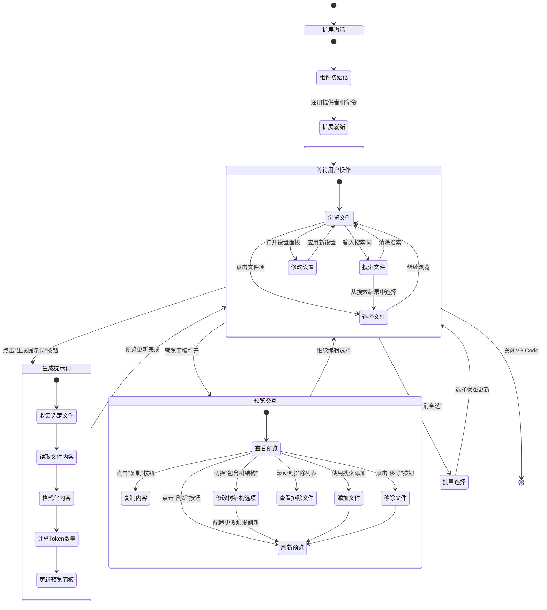
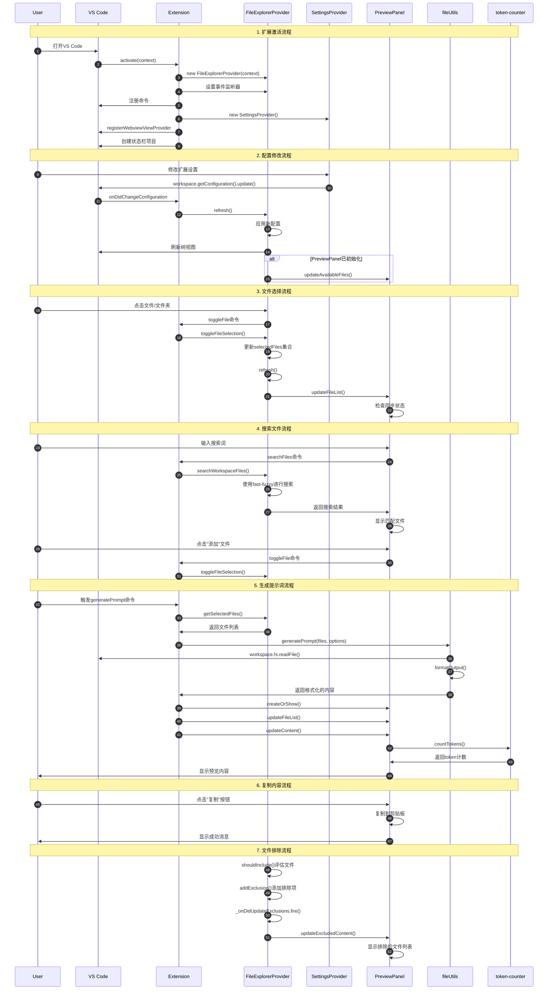

# Files to LLM Prompt - 组件详细分析

## 1. Extension.ts (扩展入口点)

`extension.ts` 是扩展的核心入口点，负责初始化各个组件并协调它们之间的交互。

### 主要职责

- 扩展生命周期管理（激活、停用）
- 初始化核心组件（FileExplorerProvider, SettingsProvider, PreviewPanel）
- 注册命令和事件处理器
- 协调组件之间的通信

### 关键函数

- `activate(context)`: 扩展激活入口点
  ```typescript
  export function activate(context: vscode.ExtensionContext) {
      const debugLogger = vscode.window.createOutputChannel("Files-to-LLM Extension");
      // 初始化各种组件和命令
  }
  ```
- `deactivate()`: 扩展停用函数
- `generatePrompt()`: 生成LLM提示词的命令处理函数

### 核心组件注册

- 创建并注册 FileExplorerProvider 实例
- 创建并注册 SettingsProvider 实例 
- 初始化 PreviewPanel
- 创建状态栏项目用于快速访问功能

### 注册的主要命令

1. `files-to-llm-prompt.refreshFileExplorer`: 刷新文件浏览器
2. `files-to-llm-prompt.searchFiles`: 搜索文件
3. `files-to-llm-prompt.generatePrompt`: 生成提示词
4. `files-to-llm-prompt.generatePromptButton`: 生成提示词按钮
5. `files-to-llm-prompt.selectAll`: 选择所有文件
6. `files-to-llm-prompt.deselectAll`: 取消选择所有文件

## 2. FileExplorerProvider.ts (文件浏览器提供者)

`FileExplorerProvider` 实现了 VS Code 的 `TreeDataProvider` 接口，为用户提供文件浏览和选择功能。

### 主要职责

- 显示工作区文件和文件夹
- 管理文件选择状态
- 实现文件过滤（基于配置）
- 处理文件包含/排除规则
- 提供文件搜索功能
- 响应配置变更并调整显示规则
- 支持目录选择功能（选择目录时会选择其下所有文件）

### 核心数据结构

- `selectedFiles`: 存储选中文件的集合
- `allFiles`: 存储所有有效文件的集合
- `excludedEntries`: 存储被排除文件的映射表
- `fileToDirectoryMap`: 文件到目录的映射表
- `_onDidChangeTreeData`: 文件树更新事件发射器
- `_onDidUpdateExclusions`: 排除规则更新事件发射器

### 关键函数

- `getChildren()`: TreeDataProvider 接口的核心方法，返回树节点的子项
- `shouldInclude()`: 决定文件是否应该显示（根据配置规则）
- `toggleFileSelection()`: 切换文件或目录的选择状态
- `searchWorkspaceFiles()`: 实现模糊搜索功能（基于fast-fuzzy库）
- `getSelectedFiles()`: 获取当前选中的文件列表
- `refresh()`: 刷新文件树显示
- `selectAll()/deselectAll()`: 批量选择/取消选择功能
- `getExcludedEntries()`: 获取被排除文件的列表
- `isDirectorySelected()`: 检查目录是否被完全选中
- `getAllFilesInDirectory()`: 获取目录下所有文件
- `notifyPreviewPanelOfChanges()`: 通知预览面板更新选择状态

### 文件过滤规则

FileExplorerProvider 根据多种规则过滤文件显示：
- 隐藏文件（以.开头的文件/文件夹）
- 自定义忽略模式（如 *.log, node_modules 等）
- 目录过滤（可选应用到文件夹）
- .gitignore 规则（可选覆盖）

## 3. SettingsProvider.ts (设置提供者)

`SettingsProvider` 实现了 VS Code 的 `WebviewViewProvider` 接口，为用户提供交互式设置界面。

### 主要职责

- 提供设置界面
- 处理设置更改
- 更新 VS Code 配置
- 通过 WebView 提供用户友好的设置管理

### 设置选项

1. `includeHidden`: 是否显示隐藏文件（以.开头）
2. `overrideGitignore`: 是否忽略 .gitignore 规则
3. `includeDirectories`: 是否将忽略模式应用于文件夹
4. `ignorePatterns`: 自定义忽略模式
5. `outputFormat`: 输出格式（默认/Claude XML）
6. `fuzzySearchThreshold`: 模糊搜索阈值
7. `includeTreeStructure`: 是否包含树结构

### 关键函数

- `resolveWebviewView()`: 初始化WebView
- `_getHtmlForWebview()`: 生成设置页面HTML
- `_setWebviewMessageListener()`: 处理WebView消息

### 与其他组件的交互

设置提供者主要通过间接方式与其他组件交互：
1. 当用户修改设置时，SettingsProvider 更新 VS Code 的配置存储
2. 配置变更事件被 extension.ts 捕获
3. extension.ts 通知 FileExplorerProvider 刷新
4. FileExplorerProvider 根据新的配置应用过滤规则

```typescript
context.subscriptions.push(
    vscode.workspace.onDidChangeConfiguration(e => {
        if (e.affectsConfiguration('files-to-llm-prompt')) {
            fileExplorerProvider.refresh();
        }
    })
);
```

这种基于事件的间接交互方式，使得组件间保持低耦合，同时确保配置变更能够即时反映在用户界面上。

## 4. PreviewPanel.ts (预览面板)

`PreviewPanel` 管理预览界面，显示生成的提示词并提供交互功能。

### 主要职责

- 显示生成的提示词内容
- 提供文件列表查看
- 支持复制、刷新等操作
- 显示Token计数
- 显示排除的文件内容

### 状态管理

- `_currentPreviewFiles`: 当前预览中使用的文件
- `_selectedFiles`: 当前选择的文件

### 关键函数

- `createOrShow()`: 创建或显示预览面板
- `updateContent()`: 更新预览内容
- `updateFileList()`: 更新文件列表
- `updateExcludedContent()`: 更新排除内容
- `_setWebviewMessageListener()`: 处理WebView消息

## 5. 工具类

### fileUtils.ts

负责文件处理和格式化输出。

#### 关键函数

- `generatePrompt()`: 从文件路径生成提示词
- `processFiles()`: 读取和处理文件
- `formatOutput()`: 格式化输出内容
- `generateTreeStructure()`: 生成工作区树结构

### gitignoreUtils.ts

处理 .gitignore 规则。

#### 关键函数

- `readGitignore()`: 读取 .gitignore 文件
- `isIgnored()`: 检查文件是否被忽略

### token-counter.ts

提供 Token 计数功能。

#### 关键函数

- `initializeEncoder()`: 初始化 tiktoken 编码器
- `countTokens()`: 计算文本的 token 数量
- `disposeEncoder()`: 释放编码器资源

## 6. WebView 前端

`index.html` 实现了预览面板的用户界面。

### 主要功能

- 显示文件列表
- 提供文件搜索框
- 显示预览内容
- 提供复制按钮
- 显示Token计数
- 显示排除的内容
- 切换树结构选项

### 主要交互

- 文件搜索和添加
- 文件移除
- 内容复制
- 面板刷新
- 配置更改

## 7. 配置和清单文件

### package.json

定义扩展的元数据、活动点、贡献点和依赖项。

#### 主要部分

- `activationEvents`: 激活事件
- `contributes.commands`: 注册的命令
- `contributes.viewsContainers`: 视图容器
- `contributes.views`: 视图定义
- `contributes.configuration`: 配置项定义

### tsconfig.json

TypeScript 编译配置。

### esbuild.js

打包构建脚本，使用 esbuild 打包扩展。

## 8. 数据流和状态管理



### 状态流向

1. **配置状态**:
   - 用户修改设置 → SettingsProvider → VS Code Configuration → FileExplorerProvider

2. **文件选择状态**:
   - 用户选择文件 → FileExplorerProvider.selectedFiles → PreviewPanel

3. **内容生成状态**:
   - generatePrompt 命令 → fileUtils.generatePrompt → PreviewPanel

### 事件通知

1. **配置变更**:
   - `onDidChangeConfiguration` → FileExplorerProvider.refresh()

2. **文件选择变更**:
   - FileExplorerProvider.toggleFileSelection() → FileExplorerProvider.notifyPreviewPanelOfChanges()

3. **排除规则变更**:
   - FileExplorerProvider._onDidUpdateExclusions.fire() → PreviewPanel.updateExcludedContent()

4. **WebView 交互**:
   - `_setWebviewMessageListener()` 处理 WebView 发送的消息

### 三个主要组件间的交互流程

1. **用户操作流程**:
   - 用户通过 SettingsProvider 修改设置
   - 设置变更触发 FileExplorerProvider 刷新
   - FileExplorerProvider 根据新设置更新文件显示
   - 用户在 FileExplorerProvider 中选择文件
   - extension.ts 中的 generatePrompt 命令使用选中的文件生成提示词

2. **数据流动**:
   - SettingsProvider → 配置存储
   - 配置变更 → FileExplorerProvider
   - FileExplorerProvider → 文件选择状态
   - 文件选择状态 → PreviewPanel

3. **事件通知链**:
   - 设置变更 → 触发配置更新
   - 配置更新 → 触发文件浏览器刷新
   - 文件选择变更 → 触发预览面板更新

这个扩展采用了典型的 VS Code 扩展架构，通过提供者模式（Provider Pattern）实现了各个功能模块的解耦，同时通过事件系统实现了组件间的通信和状态同步。

## 9. 序列图


